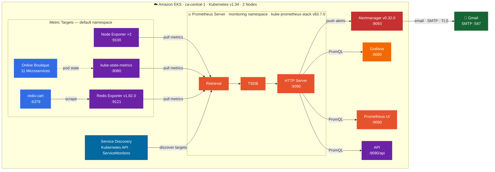

# Microservices Monitoring with Prometheus & Grafana on Amazon EKS

> **End-to-end observability pipeline** — deploying Google's Online Boutique microservices application on Amazon EKS and instrumenting it with a production-grade Prometheus monitoring stack, Grafana dashboards, custom alert rules, and automated email notifications via Alertmanager.

---

## Table of Contents

- [Overview](#overview)
- [Demo Screenshots](#demo-screenshots)
- [Architecture](#architecture)
- [Tech Stack](#tech-stack)
- [Project Structure](#project-structure)
- [Prerequisites](#prerequisites)
- [Deployment Guide](#deployment-guide)
  - [1. Provision the EKS Cluster](#1-provision-the-eks-cluster)
  - [2. Deploy the Online Boutique Application](#2-deploy-the-online-boutique-application)
  - [3. Install the Prometheus Monitoring Stack](#3-install-the-prometheus-monitoring-stack)
  - [4. Apply Custom Alert Rules](#4-apply-custom-alert-rules)
  - [5. Configure Alertmanager — Email Notifications](#5-configure-alertmanager--email-notifications)
  - [6. Deploy Redis Exporter](#6-deploy-redis-exporter)
  - [7. Apply Redis Alert Rules](#7-apply-redis-alert-rules)
- [Accessing the UIs](#accessing-the-uis)
- [Alert Rules Reference](#alert-rules-reference)
- [Testing the Alerts](#testing-the-alerts)
- [Key Concepts](#key-concepts)
- [Cleanup](#cleanup)

---

## Overview

This project demonstrates a **production-style monitoring and alerting system** for a cloud-native microservices application running on AWS. It covers the full observability lifecycle:

- Deploying a **multi-service Kubernetes application** (11 microservices)
- Installing **kube-prometheus-stack** (Prometheus Operator + Grafana + Alertmanager) via Helm
- Writing **custom PrometheusRule** manifests for CPU and pod health alerts
- Configuring **Alertmanager** to route alerts to email via Gmail SMTP
- Deploying a **Redis Prometheus Exporter** with a dedicated ServiceMonitor and alert rules
- Simulating **real-world alert scenarios** (CPU stress, pod crash loops)

---

## Demo Screenshots

### Grafana — Redis Exporter Dashboard
> Real-time Redis metrics including memory usage, connected clients, commands per second, network I/O, and key expiry — all scraped via the Prometheus Redis Exporter and visualised in Grafana.


---

### Prometheus — Alert Rules UI
> Custom `PrometheusRule` CRDs loaded and evaluated by Prometheus. `HostHighCpuLoad` transitions to **PENDING** after the CPU stress test, while Redis rules remain **INACTIVE** (healthy state).


---

### Alertmanager — Status & Configuration
> Alertmanager v0.32.0 running with the active configuration loaded — showing SMTP settings, global resolve timeout, and routing config applied via the `AlertmanagerConfig` CRD.


---

## Architecture



**Data flow — step by step:**

| Step | Component | Action |
|---|---|---|
| 1 | Prometheus Operator | Watches `PrometheusRule` & `AlertmanagerConfig` CRDs and reconciles Prometheus/Alertmanager config |
| 2 | Service Discovery | Discovers scrape targets via Kubernetes API and `ServiceMonitor` label selectors |
| 3 | Retrieval | Pulls `/metrics` from Node Exporter, kube-state-metrics, and Redis Exporter on a configured interval |
| 4 | TSDB | Stores all time-series data locally with configurable retention |
| 5 | Alert evaluation | HTTP Server continuously evaluates `PrometheusRule` expressions against stored metrics |
| 6 | Alertmanager | Receives firing alerts, deduplicates, groups, and routes them to the email receiver |
| 7 | Gmail | Delivers alert email notifications via SMTP (TLS, port 587), repeated every 30 minutes while firing |
| 8 | Grafana / Prometheus UI | Query live and historical metrics via PromQL for dashboards and ad-hoc investigation |

---

## Tech Stack

| Layer | Technology | Version |
|---|---|---|
| Cloud | AWS EKS | Kubernetes 1.34 |
| Cluster provisioning | eksctl | 0.223.0 |
| App | Google Online Boutique | v0.8.0 |
| Monitoring stack | kube-prometheus-stack (Helm) | 83.7.0 |
| Metrics engine | Prometheus | via Operator |
| Operator | Prometheus Operator | v0.90.1 |
| Alerting | Alertmanager | v0.32.0 |
| Dashboards | Grafana | bundled |
| Redis metrics | prometheus-redis-exporter | v6.22.0 / app v1.82.0 |
| Node metrics | Node Exporter | bundled |
| IaC | Helm + kubectl manifests | — |

---

## Project Structure

```
monitoring/
├── config-microservices.yaml          # All 11 Online Boutique deployments & services
├── alert-rules.yaml                   # Custom PrometheusRule: CPU + pod crash alerts
├── redis-rules.yaml                   # Custom PrometheusRule: Redis health alerts
├── alert-manager-configuration.yaml   # AlertmanagerConfig: email routing & receivers
├── email-secret.yaml                  # Kubernetes Secret: Gmail SMTP credentials
├── redis-values.yaml                  # Helm values: Redis Exporter + ServiceMonitor
└── general-yaml/
    ├── alert.yaml                     # Alertmanager StatefulSet descriptor
    ├── oper.yaml                      # Prometheus Operator deployment descriptor
    └── prom.yaml                      # Prometheus instance descriptor
```

---

## Prerequisites

Ensure the following tools are installed and configured:

- [AWS CLI](https://docs.aws.amazon.com/cli/latest/userguide/install-cliv2.html) — configured with appropriate IAM permissions
- [eksctl](https://eksctl.io/) — EKS cluster management
- [kubectl](https://kubernetes.io/docs/tasks/tools/) — Kubernetes CLI
- [Helm](https://helm.sh/docs/intro/install/) v3+ — package manager for Kubernetes
- An AWS account with permissions to create EKS clusters, EC2 instances, and VPCs

---

## Deployment Guide

### 1. Provision the EKS Cluster

```bash
eksctl create cluster
```

This provisions:
- EKS control plane in `ca-central-1` (3 availability zones)
- Managed node group with **2 x AmazonLinux2023** nodes (Kubernetes v1.34)
- Default addons: `vpc-cni`, `kube-proxy`, `coredns`, `metrics-server`
- kubeconfig saved to `~/.kube/config`

Verify nodes are ready:

```bash
kubectl get nodes
```

Expected output:
```
NAME                                              STATUS   ROLES    AGE   VERSION
ip-192-168-26-116.ca-central-1.compute.internal   Ready    <none>   5m    v1.34.6-eks-bbe087e
ip-192-168-61-68.ca-central-1.compute.internal    Ready    <none>   5m    v1.34.6-eks-bbe087e
```

---

### 2. Deploy the Online Boutique Application

```bash
kubectl apply -f config-microservices.yaml
```

This deploys 11 microservices into the `default` namespace:

| Microservice | Port | Type |
|---|---|---|
| frontend | 80 | NodePort + LoadBalancer |
| cartservice | 7070 | ClusterIP |
| checkoutservice | 5050 | ClusterIP |
| productcatalogservice | 3550 | ClusterIP |
| currencyservice | 7000 | ClusterIP |
| paymentservice | 50051 | ClusterIP |
| shippingservice | 50051 | ClusterIP |
| emailservice | 5000 | ClusterIP |
| recommendationservice | 8080 | ClusterIP |
| adservice | 9555 | ClusterIP |
| redis-cart | 6379 | ClusterIP |

The application is publicly accessible via the **LoadBalancer** external IP:

```bash
kubectl get svc frontend-external
```

---

### 3. Install the Prometheus Monitoring Stack

Add the Helm repository and install into the `monitoring` namespace:

```bash
helm repo add prometheus-community https://prometheus-community.github.io/helm-charts
helm repo update
kubectl create namespace monitoring
helm install monitoring prometheus-community/kube-prometheus-stack -n monitoring
```

Verify all pods are running:

```bash
kubectl get all -n monitoring
```

Components deployed:
- `prometheus-monitoring-kube-prometheus-prometheus-0` — Prometheus server
- `alertmanager-monitoring-kube-prometheus-alertmanager-0` — Alertmanager
- `monitoring-grafana-*` — Grafana dashboard
- `monitoring-kube-prometheus-operator-*` — Prometheus Operator
- `monitoring-kube-state-metrics-*` — Kubernetes state metrics
- `monitoring-prometheus-node-exporter-*` — Node-level metrics (one per node)

Retrieve the Grafana admin password:

```bash
kubectl --namespace monitoring get secrets monitoring-grafana \
  -o jsonpath="{.data.admin-password}" | base64 -d ; echo
```

---

### 4. Apply Custom Alert Rules

Alert rules are defined as `PrometheusRule` CRDs and picked up automatically by the Prometheus Operator (matched by label `release: monitoring`):

```bash
kubectl apply -f alert-rules.yaml
```

Verify the rule was created and is discoverable:

```bash
kubectl get prometheusrule -n monitoring
kubectl get prometheusrule main-rules -n monitoring --show-labels
```

Confirm Prometheus is configured to pick up rules with this selector:

```bash
kubectl get prometheus -n monitoring -o yaml | grep -A 5 "ruleSelector"
# ruleSelector:
#   matchLabels:
#     release: monitoring
```

---

### 5. Configure Alertmanager — Email Notifications

Alerting in Prometheus works in two parts:
1. **Prometheus** evaluates alert rules and fires alerts to Alertmanager
2. **Alertmanager** deduplicates, groups, and routes alerts to notification receivers

**Step 1 — Create the Gmail SMTP secret:**

```bash
kubectl apply -f email-secret.yaml
```

This creates a Kubernetes `Secret` named `gmail-auth` in the `monitoring` namespace containing the base64-encoded Gmail app password.

**Step 2 — Apply the AlertmanagerConfig:**

```bash
kubectl apply -f alert-manager-configuration.yaml
```

Verify the configuration was applied:

```bash
kubectl get alertmanagerconfig -n monitoring
```

The config routes `HostHighCpuLoad` and `KubernetesPodCrashLooping` alerts to the email receiver with a 30-minute repeat interval.

**Step 3 — Verify Alertmanager picked up the config:**

```bash
kubectl logs alertmanager-monitoring-kube-prometheus-alertmanager-0 \
  -n monitoring -c alertmanager | grep "Loading configuration"
```

Expected:
```
msg="Completed loading of configuration file"
```

---

### 6. Deploy Redis Exporter

The Redis Exporter exposes `redis-cart` metrics to Prometheus via a **ServiceMonitor**:

```bash
helm repo add prometheus-community https://prometheus-community.github.io/helm-charts
helm repo add stable https://charts.helm.sh/stable
helm repo update

helm install redis-exporter prometheus-community/prometheus-redis-exporter \
  -f redis-values.yaml
```

`redis-values.yaml` sets:
- `redisAddress: redis://redis-cart:6379` — points to the app's Redis instance
- `serviceMonitor.enabled: true` with label `release: monitoring` — auto-discovered by Prometheus

Verify the exporter is running and the ServiceMonitor is registered:

```bash
kubectl get pod -l app.kubernetes.io/name=prometheus-redis-exporter
kubectl get servicemonitor
```

---

### 7. Apply Redis Alert Rules

```bash
kubectl apply -f redis-rules.yaml
kubectl get prometheusrule redis-rules
```

---

## Accessing the UIs

All services use `ClusterIP` — use `kubectl port-forward` to access them locally:

**Prometheus:**
```bash
kubectl port-forward svc/monitoring-kube-prometheus-prometheus 9090:9090 -n monitoring &
# Open: http://localhost:9090
```

**Grafana:**
```bash
kubectl port-forward svc/monitoring-grafana 8080:80 -n monitoring &
# Open: http://localhost:8080
# Credentials: admin / prom-operator
```

**Alertmanager:**
```bash
kubectl port-forward -n monitoring svc/monitoring-kube-prometheus-alertmanager 9093:9093 &
# Open: http://localhost:9093
```

---

## Alert Rules Reference

### CPU & Pod Alerts (`alert-rules.yaml`)

| Alert | Expression | For | Severity | Description |
|---|---|---|---|---|
| `HostHighCpuLoad` | `100 - (avg by(instance)(rate(node_cpu_seconds_total{mode="idle"}[2m])) * 100) > 50` | 2m | Warning | Node CPU utilisation exceeds 50% |
| `KubernetesPodCrashLooping` | `kube_pod_init_container_status_restarts_total > 5` | 0m | Critical | Pod restart count exceeds 5 |

### Redis Alerts (`redis-rules.yaml`)

| Alert | Expression | For | Severity | Description |
|---|---|---|---|---|
| `RedisDown` | `redis_up == 0` | 0m | Critical | Redis instance is unreachable |
| `RedisTooManyConnections` | `redis_connected_clients / redis_config_maxclients * 100 > 90` | 2m | Warning | Redis connection pool exceeds 90% capacity |

---

## Testing the Alerts

### Simulate a CPU Spike

Deploy a stress container to push CPU above the 50% threshold:

```bash
kubectl delete pod cpu-test --ignore-not-found
kubectl run cpu-test --image=containerstack/cpustress -- --cpu 4 --timeout 60s --metrics-brief
```

Verify in Prometheus UI (`http://localhost:9090`) under **Alerts** — `HostHighCpuLoad` should transition from `Pending` → `Firing` within 2 minutes.

### Simulate High Request Load

```bash
# Deploy a curl client inside the cluster
kubectl run curl-test --image=radial/busyboxplus:curl -i --tty --rm

# Inside the pod — hammer the LoadBalancer endpoint
for i in $(seq 1 10000); do
  curl <FRONTEND_LOADBALANCER_URL> > /dev/null 2>&1
done
```

### Trigger a Pod Crash Loop

```bash
kubectl delete pod cpu-test --now
kubectl run cpu-test --image=containerstack/cpustress -- --cpu 4 --timeout 30s --metrics-brief
```

After the container exits and Kubernetes restarts it repeatedly, `KubernetesPodCrashLooping` will fire and an email notification will be delivered.

---

## Key Concepts

| Concept | Description |
|---|---|
| **PrometheusRule** | CRD that defines alert rules. Picked up by the Operator via `ruleSelector` label matching. |
| **ServiceMonitor** | CRD that tells Prometheus which services to scrape and on which port/path. |
| **AlertmanagerConfig** | CRD that defines routing trees and receivers scoped to a namespace. |
| **kube-prometheus-stack** | Helm chart bundling Prometheus, Grafana, Alertmanager, Node Exporter, and kube-state-metrics. |
| **Prometheus Operator** | Kubernetes controller that manages Prometheus and Alertmanager instances via CRDs. |
| **Redis Exporter** | Sidecar-style exporter that translates Redis `INFO` stats into Prometheus metrics. |

---

## Cleanup

To avoid AWS charges, delete all resources when done:

```bash
# Delete Helm releases
helm uninstall monitoring -n monitoring
helm uninstall redis-exporter

# Delete manifests
kubectl delete -f config-microservices.yaml
kubectl delete -f alert-rules.yaml
kubectl delete -f redis-rules.yaml
kubectl delete -f alert-manager-configuration.yaml
kubectl delete -f email-secret.yaml

# Delete namespace
kubectl delete namespace monitoring

# Destroy the EKS cluster (takes ~10 minutes)
eksctl delete cluster --name <your-cluster-name> --region ca-central-1
```

---

## References

- [kube-prometheus-stack Helm Chart](https://github.com/prometheus-community/helm-charts/tree/main/charts/kube-prometheus-stack)
- [Prometheus Operator Documentation](https://github.com/prometheus-operator/kube-prometheus)
- [Google Online Boutique](https://github.com/GoogleCloudPlatform/microservices-demo)
- [prometheus-redis-exporter](https://github.com/prometheus-community/helm-charts/tree/main/charts/prometheus-redis-exporter)
- [eksctl Documentation](https://eksctl.io/)

---

*Built with Prometheus Operator v0.90.1 · Alertmanager v0.32.0 · kube-prometheus-stack v83.7.0 · EKS Kubernetes v1.34*
